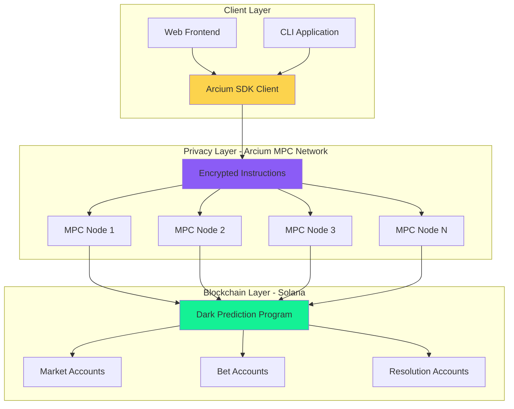
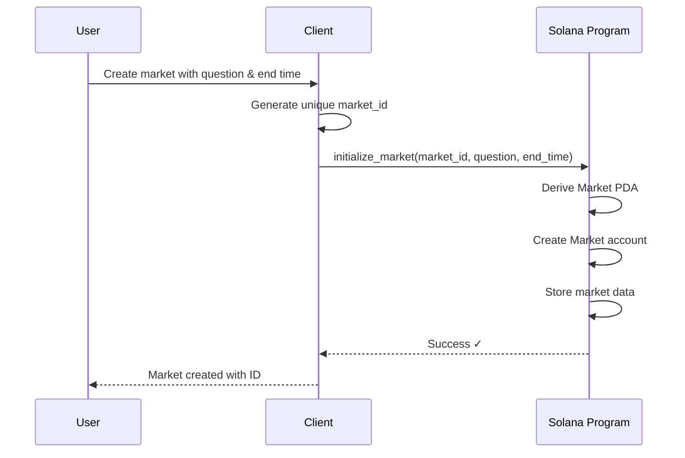
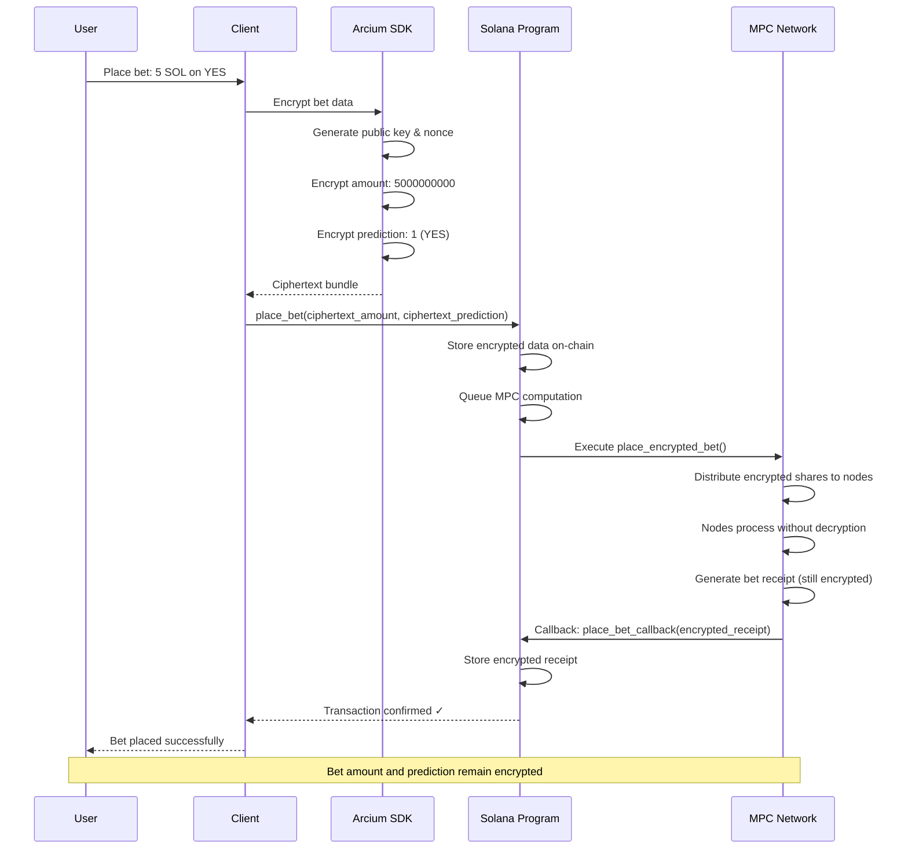
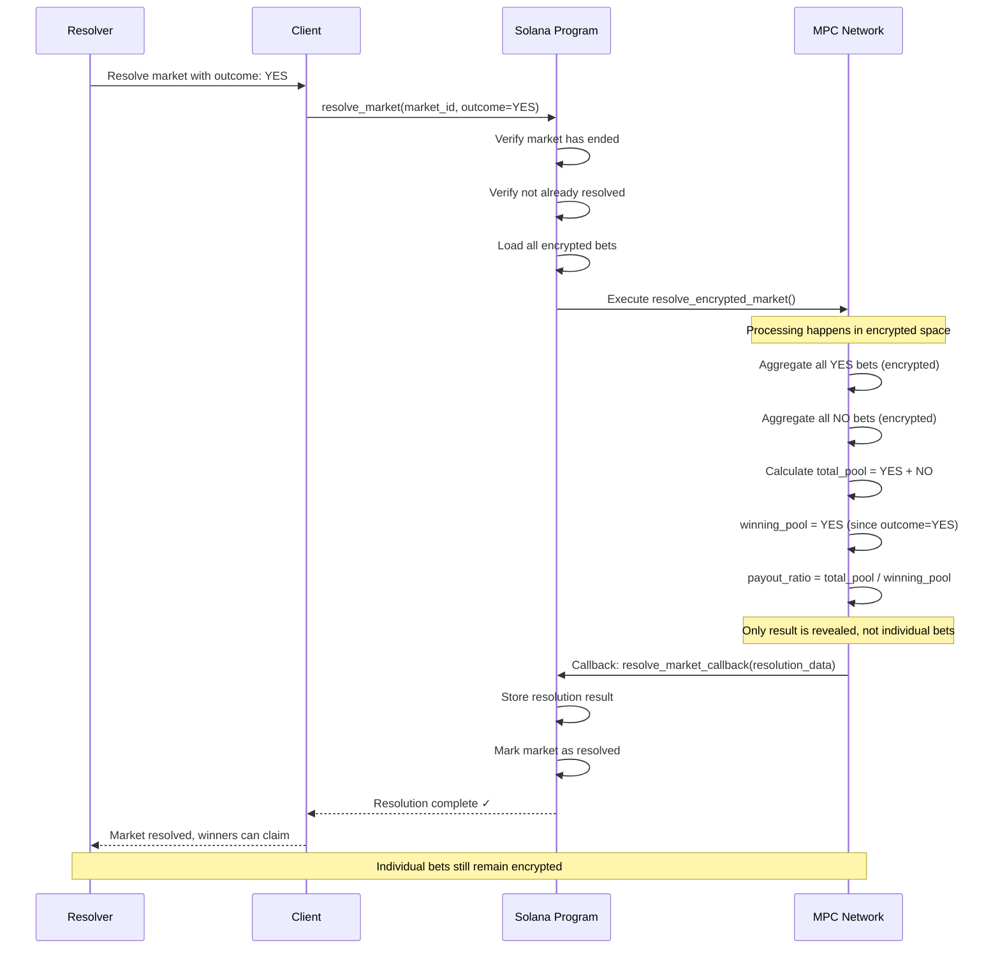
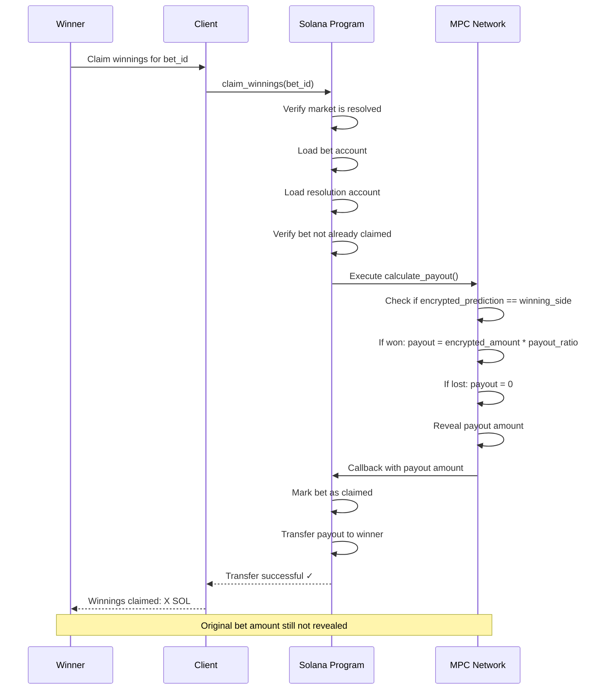

# Architecture Guide

This document explains the system architecture of the Dark Prediction Market, focusing on how Arcium's encrypted compute integrates with Solana to enable private prediction markets.

---

## Table of Contents

1. [High-Level Architecture](#high-level-architecture)
2. [Component Breakdown](#component-breakdown)
3. [Data Flow Diagrams](#data-flow-diagrams)
4. [Account Structures](#account-structures)
5. [Security Model](#security-model)
6. [Privacy Guarantees](#privacy-guarantees)

---

## High-Level Architecture

The system consists of three main layers working together:



### Layer Responsibilities

**Client Layer**
- Encrypts user data before it leaves the device
- Builds and signs Solana transactions
- Provides user interface for market interaction
- Uses Arcium SDK for encryption operations

**Privacy Layer (Arcium MPC Network)**
- Processes encrypted data without decryption
- Runs encrypted instructions across distributed nodes
- No single node has access to plaintext values
- Provides callback results to Solana program

**Blockchain Layer (Solana)**
- Stores encrypted bet data on-chain
- Manages market state and lifecycle
- Handles token transfers and settlements
- Provides transaction finality and ordering

---

## Component Breakdown

### 1. Solana Program

The on-chain program manages public state while respecting user privacy.

**Location**: `programs/dark-prediction-market/src/`

**Key Components**:

- **lib.rs**: Program entry point with instruction definitions
- **state.rs**: Account structures (Market, Bet, Resolution)
- **instructions/**: Handler logic for each instruction
- **errors.rs**: Custom error types

**Responsibilities**:
- Validate market parameters
- Store encrypted bet data (without reading it)
- Queue MPC computations via Arcium
- Process MPC callbacks with results
- Distribute winnings to winners

### 2. Arcium MPC Network

The distributed network that performs encrypted computation.

**Location**: `encrypted-ixs/`

**Encrypted Instructions**:

- **place_bet.rs**: Processes bet placement in encrypted space
- **resolve_market.rs**: Calculates resolution and payouts privately
- **generate_randomness.rs**: Creates provably fair random numbers

**How MPC Works**:
- Multiple nodes each hold a "share" of encrypted data
- Computation happens on shares without reconstructing plaintext
- Results are computed collaboratively
- Privacy is guaranteed unless majority of nodes collude

### 3. Client Applications

User-facing applications that interact with both layers.

**Locations**: 
- `app/` - CLI demo application
- `frontend/` - Next.js web interface

**Key Files**:
- **arcium-client.ts**: Encryption/decryption utilities
- **index.ts**: Demo flow orchestration
- **types.ts**: TypeScript type definitions

**Responsibilities**:
- Encrypt sensitive data locally
- Build Solana transactions
- Display market information
- Handle wallet connections
- Show encrypted vs public data appropriately

---

## Data Flow Diagrams

### Market Creation Flow

Creating a market is a straightforward on-chain operation (no encryption needed).



**Key Points**:
- Market creation doesn't involve encryption
- Anyone can create a market
- Market data is public (question, end time, creator)
- Uses PDA (Program Derived Address) for deterministic address

---

### Encrypted Bet Placement Flow

This is where Arcium's encrypted compute becomes essential.



**Key Points**:
- Encryption happens client-side before transaction submission
- Solana program never sees plaintext values
- MPC processes encrypted data across multiple nodes
- Bet receipt is also encrypted
- No single party can read the bet details

---

### Market Resolution Flow

Resolution involves MPC computation to aggregate bets and calculate payouts.



**Key Points**:
- All bets are aggregated in encrypted space
- MPC calculates pool totals without revealing individuals
- Only the final payout ratio is revealed
- Individual bet amounts remain private
- Winners are determined by their encrypted prediction matching the outcome

---

### Winnings Claim Flow

Winners claim their share of the pool based on encrypted bet data.



**Key Points**:
- Payout is calculated in MPC from encrypted bet data
- System verifies the prediction matched the outcome
- Actual bet amount is never revealed publicly
- Multiple winners each get their proportional share
- Claims are processed atomically to prevent double-claims

---

## Account Structures

All data is stored in Solana accounts using Anchor's account system.

### Market Account

Stores public information about a prediction market.

```rust
#[account]
pub struct Market {
    pub market_id: u64,           // Unique market identifier
    pub question: String,         // Market question (max 200 chars)
    pub creator: Pubkey,          // Market creator address
    pub end_time: i64,            // Unix timestamp when betting ends
    pub total_bets: u64,          // Count of bets placed
    pub resolved: bool,           // Has market been resolved?
    pub winning_side: Option<u8>, // 0=NO, 1=YES (None until resolved)
    pub bump: u8,                 // PDA bump seed
}
```

**PDA Derivation**:
```
seeds = [b"market", market_id.to_le_bytes()]
```

**Size**: 8 + 200 + 32 + 8 + 8 + 1 + 2 + 1 = ~260 bytes

**Lifecycle**:
1. Created by `initialize_market`
2. Updated with total_bets as bets are placed
3. Marked as resolved by `resolve_market`
4. Permanent (never closed)

---

### Bet Account

Stores encrypted bet information.

```rust
#[account]
pub struct Bet {
    pub bet_id: u64,                    // Unique bet identifier
    pub market_id: u64,                 // Which market this bet is for
    pub bettor: Pubkey,                 // Who placed this bet
    pub encrypted_amount: [u8; 32],     // Encrypted bet amount
    pub encrypted_prediction: [u8; 32], // Encrypted prediction (YES/NO)
    pub nonce: [u8; 16],                // Encryption nonce
    pub pub_key: [u8; 32],              // Encryption public key
    pub timestamp: i64,                 // When bet was placed
    pub claimed: bool,                  // Has payout been claimed?
    pub bump: u8,                       // PDA bump seed
}
```

**PDA Derivation**:
```
seeds = [b"bet", market_id.to_le_bytes(), bet_id.to_le_bytes()]
```

**Size**: 8 + 8 + 32 + 32 + 32 + 16 + 32 + 8 + 1 + 1 = ~170 bytes

**Privacy Properties**:
- `encrypted_amount`: Actual SOL amount is encrypted
- `encrypted_prediction`: YES or NO is encrypted
- Only MPC network can process these values
- Public fields: bettor address, timestamp, claimed status

**Lifecycle**:
1. Created by `place_bet` with encrypted data
2. Processed by MPC (data stays encrypted)
3. Used in resolution calculation (still encrypted)
4. Marked as claimed when winnings are collected
5. Permanent (not closed to preserve bet history)

---

### Resolution Account

Stores the outcome and payout information after market resolution.

```rust
#[account]
pub struct Resolution {
    pub market_id: u64,        // Which market was resolved
    pub winning_side: u8,      // 0=NO, 1=YES
    pub total_pool: u64,       // Total of all bets (in lamports)
    pub winning_pool: u64,     // Total of winning bets
    pub payout_ratio: u64,     // (total_pool / winning_pool) * 1e6
    pub resolved_at: i64,      // Unix timestamp of resolution
    pub bump: u8,              // PDA bump seed
}
```

**PDA Derivation**:
```
seeds = [b"resolution", market_id.to_le_bytes()]
```

**Size**: 8 + 1 + 8 + 8 + 8 + 8 + 1 = ~42 bytes

**How Payout Works**:
```
individual_payout = (bet_amount * payout_ratio) / 1e6
```

Example:
- Total pool: 100 SOL
- Winning pool: 60 SOL
- Payout ratio: (100/60) * 1e6 = 1,666,666
- Winner bet 10 SOL: (10 * 1,666,666) / 1e6 = 16.67 SOL

**Lifecycle**:
1. Created by `resolve_market_callback`
2. Used by `claim_winnings` to calculate payouts
3. Read-only after creation
4. Permanent record of market outcome

---

## Security Model

### Threat Model

**What we protect against**:
1. **Front-running**: Bots cannot see pending bets to exploit
2. **Market manipulation**: Large bets cannot be used to manipulate sentiment
3. **Privacy invasion**: Individual bet amounts and predictions remain private
4. **Unfair resolution**: Payouts are calculated fairly using verifiable MPC

**What we don't protect against**:
1. **Timing analysis**: Time of bet placement is public
2. **Bettor identity**: Wallet addresses are public
3. **Total bet count**: Number of bets (not amounts) is visible
4. **Network analysis**: Transaction patterns may be observable

### Trust Assumptions

**Arcium MPC Network**:
- Requires honest majority of nodes (>50%)
- Collusion of majority could break privacy
- In practice: Arcium uses secure hardware and economic incentives
- Privacy degrades gracefully (computation results still correct)

**Solana Validators**:
- Standard Solana security assumptions
- Validators cannot read encrypted data
- Consensus ensures transaction ordering
- Economic security through staking

**Client Security**:
- Users must protect their wallet private keys
- Encryption happens client-side before transmission
- Compromised client only affects that user

### Attack Scenarios & Mitigations

#### 1. Front-Running Attack

**Scenario**: Attacker monitors mempool for large bets to place their own first.

**Mitigation**: 
- Bets are encrypted before mempool
- Attacker sees ciphertext, not actual bet
- Cannot determine bet size or direction
- ✅ Attack prevented by encryption

#### 2. MEV (Maximal Extractable Value)

**Scenario**: Validators reorder transactions to extract value.

**Mitigation**:
- Encrypted data means reordering has no benefit
- Validator cannot read bet contents to optimize ordering
- MPC computation happens outside validator control
- ✅ MEV effectively eliminated for bet content

#### 3. Colluding MPC Nodes

**Scenario**: Majority of Arcium nodes collude to decrypt bets.

**Impact**:
- Colluding nodes could reconstruct plaintext
- Would require coordinated attack on multiple independent nodes
- Economic disincentives through slashing
- ⚠️ Possible but extremely difficult and detectable

#### 4. Malicious Market Creator

**Scenario**: Market creator tries to manipulate resolution.

**Mitigation**:
- Resolution uses actual outcome data (e.g., oracle)
- Creator cannot see bets before resolution
- Payout calculation happens in MPC (verifiable)
- ✅ Creator has no special privileges in resolution

#### 5. Sybil Attack

**Scenario**: Attacker creates many wallets to probe the system.

**Impact**:
- Can place many small bets to gather data
- Each bet is still independently encrypted
- Cannot aggregate to learn about other users
- ⚠️ Possible but provides minimal information

---

## Privacy Guarantees

### What Remains Private

#### During Betting Phase
- ✅ Bet amounts (exact SOL value)
- ✅ Bet predictions (YES or NO)
- ✅ Bet timing details (masked in MPC)
- ✅ Relationships between bets

#### After Resolution
- ✅ Individual bet amounts (still encrypted)
- ✅ Who bet on losing side (only winners claim)
- ✅ Exact amounts lost by losers
- ✅ Correlation between users

### What Becomes Public

#### Always Public
- Market questions and parameters
- Market creator identity
- Number of total bets (not amounts)
- Bettor wallet addresses

#### Public After Resolution
- Winning side (YES or NO)
- Total pool size (sum of all bets)
- Winning pool size (sum of winning bets)
- Payout ratio (derived from pools)
- Who won (by virtue of claiming)
- Individual payout amounts (when claimed)

### Privacy Strength

The privacy guarantees are based on:

1. **Computational Security**: Based on encryption schemes (not information-theoretic)
2. **MPC Security**: Requires honest majority of Arcium nodes
3. **Implementation Security**: Assumes correct implementation of cryptographic protocols
4. **Network Security**: Relies on secure communication between components

**In Practice**:
- Bet contents are encrypted with industry-standard cryptography
- MPC computation prevents any single node from learning values
- Privacy is maintained unless both encryption is broken AND MPC nodes collude
- This provides strong practical security for real-world use

---

## System Properties

### Correctness

- **Bet integrity**: Encrypted bets cannot be tampered with
- **Fair resolution**: MPC ensures correct payout calculations
- **Atomic claims**: Winners cannot claim more than once
- **Verifiable**: All on-chain state can be audited

### Liveness

- **Market creation**: Always available
- **Bet placement**: Depends on Arcium MPC availability
- **Resolution**: Requires MPC network availability
- **Claims**: Always available once resolved

### Performance

- **Market creation**: Single Solana transaction (~400ms)
- **Bet placement**: Solana TX + MPC callback (~2-5s)
- **Resolution**: Solana TX + MPC aggregation (~5-15s depending on bet count)
- **Claims**: Single Solana transaction (~400ms)

### Scalability

- **Markets**: Unlimited (bounded by Solana throughput)
- **Bets per market**: Unlimited (bounded by MPC processing)
- **Concurrent operations**: High (Solana can handle ~65k TPS)
- **Bottleneck**: MPC resolution time for markets with many bets

---

## Comparison: With vs Without Arcium

### Traditional Public Prediction Market

```
User: "I bet 10 SOL on YES"
      ↓
Transaction in mempool (visible to all)
      ↓
Front-runner: "I see a 10 SOL bet, let me front-run it"
      ↓
On-chain: Everyone can see amount, prediction, bettor
      ↓
Market: Can be manipulated based on visible positions
```

**Problems**:
- No privacy
- Front-running possible
- Market manipulation easy
- Professional disadvantage

### Dark Prediction Market with Arcium

```
User: "I bet 10 SOL on YES"
      ↓
Client encrypts: amount → ciphertext_A, prediction → ciphertext_B
      ↓
Transaction in mempool (only ciphertext visible)
      ↓
Front-runner: "I see ciphertext, but can't read it"
      ↓
MPC Network: Processes encrypted data without decryption
      ↓
On-chain: Stores encrypted bet
      ↓
Market: No one knows positions until resolution
```

**Advantages**:
- Strong privacy
- Front-running prevented
- Fair market dynamics
- Professional parity

---

## Next Steps

For more detailed information:

- **[ARCIUM_INTEGRATION.md](./ARCIUM_INTEGRATION.md)** - Deep dive into how Arcium encryption works
- **[CODE_GUIDE.md](./CODE_GUIDE.md)** - Line-by-line code walkthrough
- **[README.md](./README.md)** - Project overview and quick start

---

*Architecture designed for privacy, implemented with Arcium encrypted compute on Solana.*

