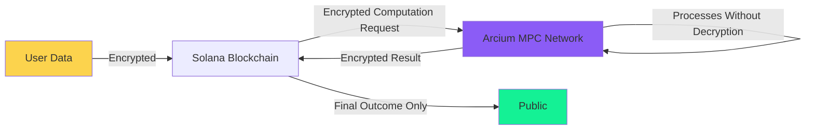
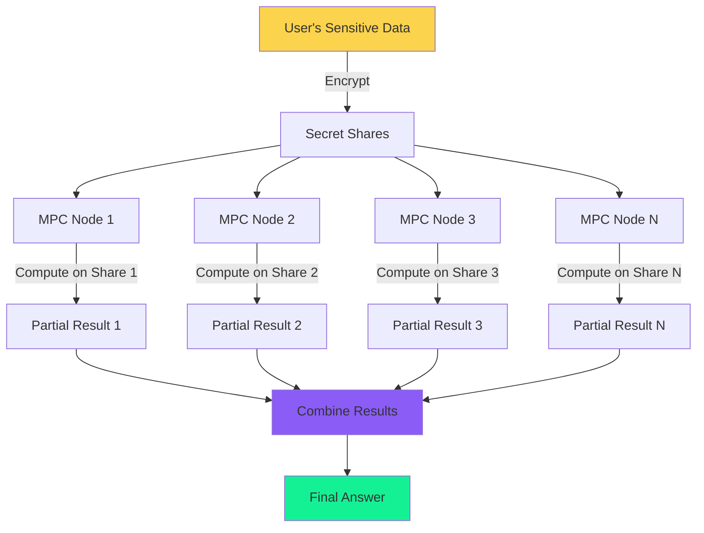
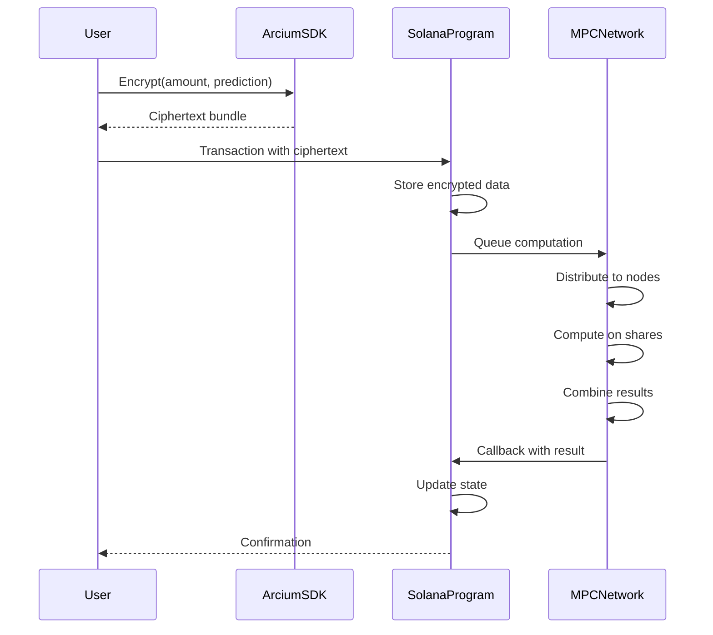
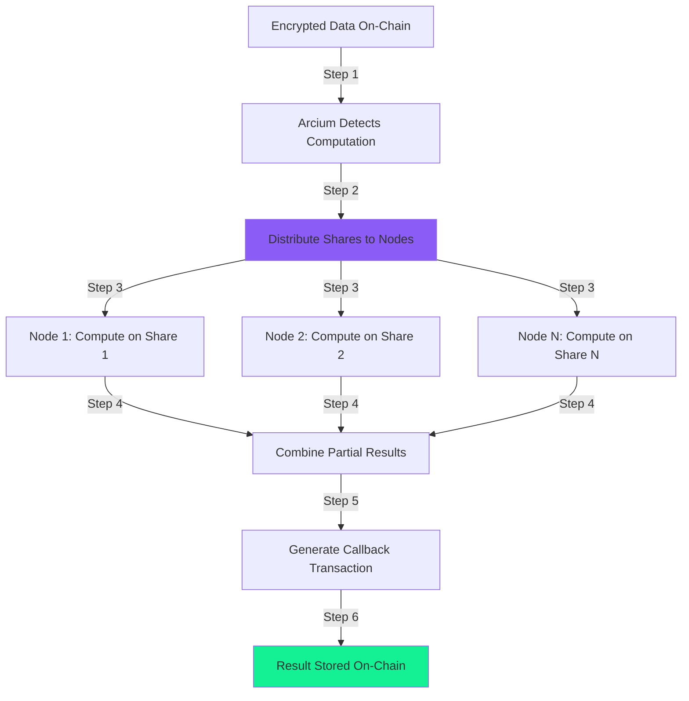

# Arcium Integration Deep Dive

This document explains how we integrate Arcium's encrypted compute into the Dark Prediction Market, why it matters, and how the technology works under the hood.

---

## Table of Contents

1. [What is Arcium?](#what-is-arcium)
2. [Why Encrypted Compute Matters](#why-encrypted-compute-matters)
3. [How MPC Works](#how-mpc-works)
4. [Integration Architecture](#integration-architecture)
5. [Encrypted Instructions](#encrypted-instructions)
6. [Encryption Flow](#encryption-flow)
7. [Privacy Guarantees](#privacy-guarantees)
8. [Code Examples](#code-examples)
9. [With vs Without Arcium](#with-vs-without-arcium)

---

## What is Arcium?

Arcium is the **encrypted supercomputer** for blockchain applications. It allows programs to process sensitive data without ever seeing the actual values, using Multi-Party Computation (MPC).

### The Core Problem

Public blockchains are transparent by design. Every transaction, every value, every piece of data is visible to everyone. This is great for auditability but terrible for privacy. 

On Solana specifically:
- Every bet amount is public
- Every prediction is visible
- Front-running bots monitor the mempool
- MEV extractors can reorder transactions
- Your financial decisions become permanent public record

### Arcium's Solution

Arcium provides a **privacy layer** that sits alongside Solana:



**Key Properties**:
- Data is encrypted before it reaches the blockchain
- Computation happens on encrypted data
- No single party can decrypt the values
- Results can be selectively revealed
- Everything remains verifiable on-chain

---

## Why Encrypted Compute Matters

### The Privacy Trilemma

Traditional systems force you to choose two out of three:

1. **Privacy**: Keep data confidential
2. **Computation**: Perform calculations on data
3. **Decentralization**: No single trusted party

```
Traditional Solutions:
├── Private + Computed = Centralized (requires trusted party)
├── Private + Decentralized = No Computation (end-to-end encryption)
└── Computed + Decentralized = No Privacy (public blockchain)
```

**Arcium solves this trilemma**: You get all three simultaneously through MPC.

### Real-World Impact for Prediction Markets

Without encrypted compute, prediction markets face serious issues:

#### 1. Front-Running

**Scenario**: Alice wants to bet 1000 SOL on YES.

**Without Arcium**:
```
Alice submits: "Bet 1000 SOL on YES"
      ↓
Transaction in mempool (visible)
      ↓
Bot sees large bet → Fronts runs with 2000 SOL on YES
      ↓
Alice's bet processed second → Worse odds
      ↓
Bot sells position → Profits from Alice's information
```

**With Arcium**:
```
Alice submits: "Bet [encrypted] on [encrypted]"
      ↓
Transaction in mempool (ciphertext only)
      ↓
Bot sees gibberish → Cannot front-run
      ↓
Alice's bet processed fairly
      ↓
No information leakage
```

#### 2. Market Manipulation

**Without Arcium**: Whales can move markets by revealing large positions, causing cascading effects as others follow.

**With Arcium**: Position sizes remain hidden until resolution, preventing psychological manipulation and herd behavior.

#### 3. Strategic Disadvantage

**Without Arcium**: Sophisticated traders can analyze on-chain data to reverse-engineer strategies and counter-position.

**With Arcium**: Even professional traders cannot see inside others' positions, creating a level playing field.

---

## How MPC Works

Multi-Party Computation (MPC) is the cryptographic magic that makes this possible.

### The Intuition

Imagine three friends who want to know their average salary without revealing individual salaries:

**Traditional Approach** (breaks privacy):
- Alice: $50k
- Bob: $70k
- Carol: $80k
- Everyone shares → Average: $66.7k
- ❌ Everyone knows everyone's salary

**MPC Approach** (preserves privacy):
1. Each person splits their salary into 3 random "shares"
   - Alice: [15, 20, 15] (sum = 50)
   - Bob: [30, 15, 25] (sum = 70)
   - Carol: [10, 45, 25] (sum = 80)

2. Each person gets one share from everyone:
   - Alice gets: [15, 30, 10] = 55
   - Bob gets: [20, 15, 45] = 80
   - Carol gets: [15, 25, 25] = 65

3. They sum their shares and combine:
   - Total: 55 + 80 + 65 = 200
   - Average: 200/3 = 66.7k
   - ✅ Result is correct, but no one learned anyone's salary!

### MPC in Arcium

Arcium's MPC network works similarly but with blockchain-level security:



**Key Properties**:
1. **Secret Sharing**: Data is split into shares
2. **Distributed Computation**: Each node computes on its share
3. **No Reconstruction**: Plaintext is never reassembled
4. **Verifiable**: Results can be cryptographically verified
5. **Threshold Security**: Requires majority collusion to break

### Security Guarantees

**Information-Theoretic Security**: 
- Individual shares reveal NO information about the plaintext
- Even with infinite computing power, a share alone is useless

**Honest Majority Assumption**:
- If >50% of nodes are honest, privacy is guaranteed
- Colluding minority cannot learn anything
- Arcium uses economic incentives to ensure honesty

**Practical Security**:
- Nodes run in secure enclaves (hardware-level protection)
- Economic slashing for malicious behavior
- Decentralized node operator set
- Continuous monitoring and verification

---

## Integration Architecture

Our integration with Arcium involves three main components:

### 1. Client-Side Encryption

**Location**: `app/arcium-client.ts`, `frontend/lib/arcium-client.ts`

Users encrypt data before it leaves their device:

```typescript
import { ArciumClient } from '@arcium-hq/client';

const client = new ArciumClient(mxePublicKey);

// Encrypt bet data
const encryptedData = await client.encryptBet({
    marketId: 1n,
    betAmount: 5_000_000_000n,  // 5 SOL in lamports
    prediction: 1,               // YES
    userNonce: Date.now()
});

// Returns ciphertext bundle
{
    ciphertext_bet_amount: Uint8Array(32),
    ciphertext_prediction: Uint8Array(32),
    pub_key: Uint8Array(32),
    nonce: 128-bit number
}
```

### 2. On-Chain State Management

**Location**: `programs/dark-prediction-market/src/`

The Solana program stores encrypted data and coordinates MPC:

```rust
// Store encrypted bet (program cannot read these values)
pub struct Bet {
    pub encrypted_amount: [u8; 32],     // Ciphertext
    pub encrypted_prediction: [u8; 32], // Ciphertext
    pub nonce: [u8; 16],
    pub pub_key: [u8; 32],
    // ... other fields
}

// Queue MPC computation
pub fn place_bet(
    ctx: Context<PlaceBet>,
    ciphertext_bet_amount: [u8; 32],
    ciphertext_prediction: [u8; 32],
    // ...
) -> Result<()> {
    // Store encrypted data
    bet.encrypted_amount = ciphertext_bet_amount;
    bet.encrypted_prediction = ciphertext_prediction;
    
    // Queue MPC computation via Arcium
    // (Actual integration uses Arcium SDK)
    
    Ok(())
}
```

### 3. Encrypted Instructions

**Location**: `encrypted-ixs/`

These run on the Arcium MPC network in encrypted space:

```rust
// This code runs across distributed MPC nodes
#[encrypted]
mod circuits {
    #[instruction]
    pub fn place_encrypted_bet(
        input_ctxt: Enc<Shared, BetInput>
    ) -> Enc<Shared, BetReceipt> {
        let input = input_ctxt.to_arcis();
        
        // All operations on encrypted data
        // No node sees plaintext values
        
        let receipt = BetReceipt {
            bet_id: generate_id(&input),
            encrypted_amount: input.bet_amount,     // Still encrypted
            encrypted_prediction: input.prediction,  // Still encrypted
            timestamp: 0,
        };
        
        input_ctxt.owner.from_arcis(receipt)
    }
}
```

### Integration Flow



---

## Encrypted Instructions

Let's dive into each encrypted instruction we implement.

### 1. Place Bet (`place_bet.rs`)

Processes bet placement without revealing amounts or predictions.

**Purpose**: 
- Validate and record encrypted bets
- Generate unique bet IDs
- Create encrypted receipts

**Code Breakdown**:

```rust
#[encrypted]
mod circuits {
    /// Input: Encrypted bet data
    pub struct BetInput {
        pub market_id: u64,
        pub bet_amount: u64,    // Encrypted lamports
        pub prediction: u8,      // Encrypted 0 or 1
        pub user_nonce: u64,
    }
    
    /// Output: Encrypted receipt
    pub struct BetReceipt {
        pub bet_id: u64,
        pub encrypted_amount: u64,
        pub encrypted_prediction: u8,
        pub timestamp: u64,
    }
    
    #[instruction]
    pub fn place_encrypted_bet(
        input_ctxt: Enc<Shared, BetInput>
    ) -> Enc<Shared, BetReceipt> {
        // Convert to Arcis encrypted type
        let input = input_ctxt.to_arcis();
        
        // Compute on encrypted values
        // This happens across MPC nodes
        let bet_id = input.market_id * 1000000u64 + input.user_nonce;
        
        // Create receipt (still encrypted)
        let receipt = BetReceipt {
            bet_id,
            encrypted_amount: input.bet_amount,      // Stays encrypted
            encrypted_prediction: input.prediction,  // Stays encrypted
            timestamp: 0u64,
        };
        
        // Return encrypted receipt
        input_ctxt.owner.from_arcis(receipt)
    }
}
```

**What's Encrypted**:
- ✅ `bet_amount`: Actual SOL value
- ✅ `prediction`: YES or NO choice
- ❌ `market_id`: Public (needed for routing)
- ❌ `bet_id`: Public (needed for claims)

**Privacy Guarantee**: No node in the MPC network can determine the bet amount or prediction.

---

### 2. Resolve Market (`resolve_market.rs`)

Aggregates all bets and calculates payouts in encrypted space.

**Purpose**:
- Sum all YES bets (without revealing individuals)
- Sum all NO bets (without revealing individuals)
- Calculate payout ratio
- Reveal only the aggregate results

**Code Breakdown**:

```rust
#[encrypted]
mod circuits {
    pub struct MarketState {
        pub market_id: u64,
        pub total_yes_bets: u64,    // Aggregate (encrypted)
        pub total_no_bets: u64,     // Aggregate (encrypted)
        pub bet_count: u32,
        pub actual_outcome: u8,
    }
    
    pub struct ResolutionResult {
        pub market_id: u64,
        pub winning_side: u8,       // Will be revealed
        pub total_pool: u64,        // Will be revealed
        pub winning_pool: u64,      // Will be revealed
        pub payout_ratio: u64,      // Will be revealed
    }
    
    #[instruction]
    pub fn resolve_encrypted_market(
        state_ctxt: Enc<Shared, MarketState>
    ) -> Enc<Shared, ResolutionResult> {
        let state = state_ctxt.to_arcis();
        
        // All math happens on encrypted values
        let total_pool = state.total_yes_bets + state.total_no_bets;
        
        // Conditional on encrypted outcome
        let winning_pool = if state.actual_outcome == 1u8 {
            state.total_yes_bets
        } else {
            state.total_no_bets
        };
        
        // Calculate payout ratio (scaled by 1e6 for precision)
        let payout_ratio = if winning_pool > 0u64 {
            (total_pool * 1000000u64) / winning_pool
        } else {
            1000000u64
        };
        
        // Create result
        let result = ResolutionResult {
            market_id: state.market_id,
            winning_side: state.actual_outcome,
            total_pool,
            winning_pool,
            payout_ratio,
        };
        
        // Result will be revealed (but individual bets stay encrypted)
        state_ctxt.owner.from_arcis(result)
    }
}
```

**What Gets Revealed**:
- Total pool size (sum of all bets)
- Winning pool size (sum of winning bets)
- Payout ratio (derived from pools)
- Winning side (YES or NO)

**What Stays Private**:
- Individual bet amounts
- Who bet on which side
- Exact bet timing
- Relationships between bets

**The Magic**: MPC allows us to compute sums without seeing individual values!

---

### 3. Generate Randomness (`generate_randomness.rs`)

Creates provably fair random numbers using MPC.

**Purpose**:
- Generate unpredictable random values
- Ensure no single party can manipulate outcomes
- Useful for tiebreakers or random selection

**Code Breakdown**:

```rust
#[encrypted]
mod circuits {
    pub struct RandomInput {
        pub seed1: u64,    // From user
        pub seed2: u64,    // From oracle
        pub seed3: u64,    // From blockchain
        pub modulus: u64,  // Range limiter
    }
    
    #[instruction]
    pub fn generate_random(
        input_ctxt: Enc<Shared, RandomInput>
    ) -> u64 {
        let input = input_ctxt.to_arcis();
        
        // Combine seeds in MPC
        // No single node knows all seeds
        let combined = (input.seed1 ^ input.seed2) + input.seed3;
        
        // Apply modulus
        let random_value = if input.modulus > 0u64 {
            combined % input.modulus
        } else {
            combined
        };
        
        // Reveal the random number
        random_value.reveal()
    }
}
```

**Fairness Property**: Since seeds come from different sources and are combined in MPC, no single party can predict or manipulate the result.

**Use Cases**:
- Random market selection for features
- Tiebreakers in exact-tie scenarios
- Future: Randomized reward distribution

---

## Encryption Flow

Let's trace how data flows through the system.

### Encryption (Client → Chain)

```mermaid
graph TB
    A[User Input: 5 SOL on YES] -->|Step 1| B[Generate Keypair]
    B -->|Step 2| C[Create Nonce]
    C -->|Step 3| D[Encrypt Amount: 5 SOL → [ciphertext_A]]
    D -->|Step 4| E[Encrypt Prediction: YES → [ciphertext_B]]
    E -->|Step 5| F[Build Transaction]
    F -->|Step 6| G[Submit to Solana]
    G --> H[Stored On-Chain Encrypted]
    
    style A fill:#FCD34D
    style H fill:#8B5CF6
```

**Step-by-Step**:

1. **Generate Keypair**: Create encryption keys locally
   ```typescript
   const keypair = generateEncryptionKeypair();
   ```

2. **Create Nonce**: Generate unique nonce for this encryption
   ```typescript
   const nonce = generateNonce();
   ```

3. **Encrypt Amount**: Encrypt the bet amount
   ```typescript
   const ciphertext_amount = encrypt(
       betAmount,      // 5_000_000_000 lamports
       keypair.public,
       nonce
   );
   ```

4. **Encrypt Prediction**: Encrypt the YES/NO prediction
   ```typescript
   const ciphertext_prediction = encrypt(
       1,              // 1 = YES, 0 = NO
       keypair.public,
       nonce
   );
   ```

5. **Build Transaction**: Create Solana transaction
   ```typescript
   const tx = await program.methods
       .placeBet(
           computationOffset,
           Array.from(ciphertext_amount),
           Array.from(ciphertext_prediction),
           Array.from(keypair.public),
           nonce
       )
       .accounts({ ... })
       .transaction();
   ```

6. **Submit**: Send to Solana network
   ```typescript
   const signature = await sendTransaction(tx, wallet);
   ```

---

### Processing (Chain → MPC → Chain)



**The MPC Process**:

1. **Detection**: Arcium network monitors for queued computations

2. **Distribution**: Encrypted data is split into shares
   ```
   amount_encrypted → [share_1, share_2, ..., share_n]
   ```

3. **Parallel Computation**: Each node processes its share
   ```
   Node 1: compute(share_1) → partial_result_1
   Node 2: compute(share_2) → partial_result_2
   Node N: compute(share_n) → partial_result_n
   ```

4. **Combination**: Partial results are combined
   ```
   final_result = combine(partial_result_1, ..., partial_result_n)
   ```

5. **Callback**: Arcium submits result back to Solana
   ```rust
   // Solana program receives callback
   pub fn place_bet_callback(
       ctx: Context<PlaceBetCallback>,
       encrypted_receipt: Vec<u8>
   ) -> Result<()> {
       // Store the encrypted receipt
       ctx.accounts.bet.receipt = encrypted_receipt;
       Ok(())
   }
   ```

---

## Privacy Guarantees

### Cryptographic Guarantees

#### 1. Encryption Security

**Property**: Ciphertext reveals no information about plaintext

**Based On**: Industry-standard encryption (e.g., AES, ChaCha20)

**Guarantee**: Computationally infeasible to break without the key

#### 2. MPC Security

**Property**: No single node learns sensitive values

**Based On**: Secret sharing threshold cryptography

**Guarantee**: Requires majority collusion to break privacy

#### 3. Verifiability

**Property**: Computation results are correct

**Based On**: Cryptographic commitment schemes

**Guarantee**: Incorrect results are detectable and provable

### Practical Privacy

**What Attackers Cannot Do**:

❌ **Read individual bets**: Encryption prevents reading plaintext
❌ **Front-run based on amount**: Amounts are encrypted in mempool
❌ **Manipulate MPC computation**: Requires majority node collusion
❌ **Fake bet receipts**: Cryptographically bound to original data
❌ **Determine who bet on winning side**: Until they claim winnings

**What Attackers Can Do (Inherent Limitations)**:

✅ **See transaction timing**: When transactions are submitted (not amounts)
✅ **See wallet addresses**: Who participated (not what they bet)
✅ **Count total bets**: Number of bets (not individual amounts)
✅ **Analyze network patterns**: Transaction graphs (not content)

### Privacy vs Transparency Trade-offs

We carefully balance privacy with necessary transparency:

| Aspect | Privacy Level | Reasoning |
|--------|--------------|-----------|
| Bet amounts | Fully private | Core protection against manipulation |
| Bet predictions | Fully private | Prevents front-running |
| Bet timing | Partially private | Blockchain ordering is inherently public |
| Bettor identity | Public | Required for wallet-based auth |
| Market outcome | Public after resolution | Needed for verifiability |
| Pool totals | Public after resolution | Needed for payout verification |
| Individual payouts | Public when claimed | SOL transfers are public |

---

## Code Examples

### Example 1: Encrypting a Bet

```typescript
import { ArciumClient } from './arcium-client';
import { Connection, PublicKey } from '@solana/web3.js';

async function placeBet() {
    // Initialize Arcium client
    const mxePublicKey = await getMXEPublicKey(programId);
    const arciumClient = new ArciumClient(mxePublicKey);
    
    // Prepare bet data
    const betData = {
        marketId: 1n,
        betAmount: 5_000_000_000n,  // 5 SOL
        prediction: 1,               // YES
        userNonce: BigInt(Date.now())
    };
    
    // Encrypt the bet
    const encrypted = await arciumClient.encryptBet(betData);
    
    console.log('Encrypted bet data:');
    console.log('- Amount ciphertext:', encrypted.ciphertext_bet_amount);
    console.log('- Prediction ciphertext:', encrypted.ciphertext_prediction);
    console.log('- Public key:', encrypted.pub_key);
    console.log('- Nonce:', encrypted.nonce);
    
    // Submit to Solana
    const tx = await program.methods
        .placeBet(
            computationOffset,
            Array.from(encrypted.ciphertext_bet_amount),
            Array.from(encrypted.ciphertext_prediction),
            Array.from(encrypted.pub_key),
            encrypted.nonce
        )
        .accounts({
            market: marketPda,
            bet: betPda,
            bettor: wallet.publicKey,
            systemProgram: SystemProgram.programId,
        })
        .rpc();
    
    console.log('Bet placed! Signature:', tx);
}
```

### Example 2: Processing Encrypted Bet in MPC

```rust
// encrypted-ixs/place_bet.rs

use arcis_imports::*;

#[encrypted]
mod circuits {
    use arcis_imports::*;
    
    pub struct BetInput {
        pub market_id: u64,
        pub bet_amount: u64,   // This is encrypted
        pub prediction: u8,    // This is encrypted
        pub user_nonce: u64,
    }
    
    pub struct BetReceipt {
        pub bet_id: u64,
        pub encrypted_amount: u64,
        pub encrypted_prediction: u8,
        pub timestamp: u64,
    }
    
    #[instruction]
    pub fn place_encrypted_bet(
        input_ctxt: Enc<Shared, BetInput>
    ) -> Enc<Shared, BetReceipt> {
        // This code runs in MPC across multiple nodes
        // No single node can see the actual values
        
        let input = input_ctxt.to_arcis();
        
        // Generate unique bet ID
        // This computation happens on encrypted data
        let bet_id = input.market_id * 1000000u64 + input.user_nonce;
        
        // Create receipt with encrypted values
        let receipt = BetReceipt {
            bet_id,
            encrypted_amount: input.bet_amount,     // Still encrypted!
            encrypted_prediction: input.prediction,  // Still encrypted!
            timestamp: 0u64,
        };
        
        // Return encrypted receipt
        input_ctxt.owner.from_arcis(receipt)
    }
}
```

### Example 3: Resolving Market with MPC

```rust
// encrypted-ixs/resolve_market.rs

#[encrypted]
mod circuits {
    use arcis_imports::*;
    
    #[instruction]
    pub fn resolve_encrypted_market(
        state_ctxt: Enc<Shared, MarketState>
    ) -> Enc<Shared, ResolutionResult> {
        let state = state_ctxt.to_arcis();
        
        // Sum all bets in encrypted space
        // Individual amounts never revealed
        let total_pool = state.total_yes_bets + state.total_no_bets;
        
        // Determine winning pool based on outcome
        let winning_pool = if state.actual_outcome == 1u8 {
            state.total_yes_bets  // Encrypted sum
        } else {
            state.total_no_bets   // Encrypted sum
        };
        
        // Calculate payout ratio
        // Division on encrypted values
        let payout_ratio = if winning_pool > 0u64 {
            (total_pool * 1000000u64) / winning_pool
        } else {
            1000000u64
        };
        
        let result = ResolutionResult {
            market_id: state.market_id,
            winning_side: state.actual_outcome,
            total_pool,      // Will be revealed
            winning_pool,    // Will be revealed
            payout_ratio,    // Will be revealed
        };
        
        // These aggregates are revealed, but individual bets stay encrypted
        state_ctxt.owner.from_arcis(result)
    }
}
```

---

## With vs Without Arcium

Let's see the concrete differences in implementation and outcomes.

### Scenario: Three Users Bet on a Market

**Market Question**: "Will Bitcoin reach $100k by end of October?"

**Bets**:
- Alice: 10 SOL on YES
- Bob: 5 SOL on NO
- Carol: 15 SOL on YES

**Actual Outcome**: YES (Bitcoin reaches $100k)

---

### Without Arcium (Traditional Public Market)

#### On-Chain State

```rust
// Everything is visible
pub struct Bet {
    pub bettor: Pubkey,
    pub amount: u64,        // 10000000000 (10 SOL) - VISIBLE
    pub prediction: u8,     // 1 (YES) - VISIBLE
    pub timestamp: i64,
}
```

#### What Everyone Can See

```
Block 1000: Alice bet 10 SOL on YES at 10:00 AM
Block 1001: Bob saw Alice's bet, bet 5 SOL on NO at 10:01 AM
Block 1002: Carol saw both, bet 15 SOL on YES at 10:02 AM

Current state (visible to all):
├── YES pool: 25 SOL (Alice: 10, Carol: 15)
├── NO pool: 5 SOL (Bob: 5)
└── Expected YES payout: 1.2x
```

#### Problems

1. **Front-running**: Bob saw Alice's 10 SOL bet and positioned accordingly
2. **Market manipulation**: Carol's large 15 SOL bet influenced later participants
3. **Privacy invasion**: Everyone knows each person's financial position
4. **Strategic disadvantage**: Later bettors have more information

---

### With Arcium (Dark Prediction Market)

#### On-Chain State

```rust
// Encrypted values
pub struct Bet {
    pub bettor: Pubkey,
    pub encrypted_amount: [u8; 32],    // 0x7a9f3b... - GIBBERISH
    pub encrypted_prediction: [u8; 32], // 0x2e4c8d... - GIBBERISH
    pub nonce: [u8; 16],
    pub pub_key: [u8; 32],
    pub timestamp: i64,
}
```

#### What Everyone Can See

```
Block 1000: Alice placed a bet at 10:00 AM
            Amount: [encrypted]
            Prediction: [encrypted]

Block 1001: Bob placed a bet at 10:01 AM
            Amount: [encrypted]
            Prediction: [encrypted]

Block 1002: Carol placed a bet at 10:02 AM
            Amount: [encrypted]
            Prediction: [encrypted]

Current state (before resolution):
├── Total bets: 3
├── Individual amounts: UNKNOWN
├── Individual predictions: UNKNOWN
└── Pool distribution: UNKNOWN
```

#### After Resolution (Via MPC)

```
Resolution Result:
├── Winning side: YES
├── Total pool: 30 SOL (revealed aggregate)
├── Winning pool: 25 SOL (revealed aggregate)
├── Payout ratio: 1.2x
└── Individual bets: STILL ENCRYPTED

Winners claim:
├── Alice claims: 12 SOL (revealed only when she claims)
├── Carol claims: 18 SOL (revealed only when she claims)
└── Bob doesn't claim (lost, amount never revealed)
```

#### Advantages

1. ✅ **No front-running**: Bob couldn't see Alice's position
2. ✅ **No manipulation**: Carol's large bet didn't influence others
3. ✅ **Privacy preserved**: Bet amounts revealed only on claim
4. ✅ **Level playing field**: All bettors had equal information

---

### Code Comparison

#### Without Arcium

```rust
// place_bet.rs (traditional)
pub fn place_bet(
    ctx: Context<PlaceBet>,
    amount: u64,      // Plaintext, visible to all
    prediction: u8,   // Plaintext, visible to all
) -> Result<()> {
    let bet = &mut ctx.accounts.bet;
    
    // Store plaintext values
    bet.amount = amount;             // EVERYONE CAN SEE THIS
    bet.prediction = prediction;      // EVERYONE CAN SEE THIS
    bet.bettor = ctx.accounts.bettor.key();
    
    // Transfer tokens
    transfer(/* ... */)?;
    
    Ok(())
}
```

#### With Arcium

```rust
// place_bet.rs (with Arcium)
pub fn place_bet(
    ctx: Context<PlaceBet>,
    computation_offset: u64,
    ciphertext_amount: [u8; 32],     // Encrypted, unreadable
    ciphertext_prediction: [u8; 32],  // Encrypted, unreadable
    pub_key: [u8; 32],
    nonce: u128,
) -> Result<()> {
    let bet = &mut ctx.accounts.bet;
    
    // Store encrypted values (program cannot read these)
    bet.encrypted_amount = ciphertext_amount;           // ENCRYPTED
    bet.encrypted_prediction = ciphertext_prediction;    // ENCRYPTED
    bet.nonce = nonce.to_le_bytes();
    bet.pub_key = pub_key;
    bet.bettor = ctx.accounts.bettor.key();
    
    // Queue MPC computation
    // Processing happens in Arcium network
    
    Ok(())
}

// Callback receives MPC result
pub fn place_bet_callback(
    ctx: Context<PlaceBetCallback>,
    encrypted_receipt: Vec<u8>,
) -> Result<()> {
    // Store result from MPC (still encrypted)
    ctx.accounts.bet.receipt = encrypted_receipt;
    Ok(())
}
```

---

## Integration Checklist

If you're building something similar, here's what you need:

### Setup
- [ ] Install Arcium CLI and SDK
- [ ] Configure `Arcium.toml` with program ID
- [ ] Set up MXE (Multi-party Execution Environment) keys
- [ ] Deploy encrypted instructions to Arcium network

### Client Integration
- [ ] Import `@arcium-hq/client` package
- [ ] Generate encryption keypairs for users
- [ ] Implement data encryption before transaction submission
- [ ] Handle encrypted responses from MPC callbacks

### Program Integration
- [ ] Add encrypted data fields to account structures
- [ ] Implement instruction to queue MPC computations
- [ ] Implement callback instructions to receive MPC results
- [ ] Handle both encrypted and plaintext data appropriately

### Encrypted Instructions
- [ ] Define input/output structures with encryption annotations
- [ ] Implement computation logic using encrypted types
- [ ] Test locally with Arcium simulator
- [ ] Deploy to Arcium testnet/mainnet

### Testing
- [ ] Unit tests for encryption/decryption
- [ ] Integration tests for full flow
- [ ] Test MPC callback handling
- [ ] Verify privacy properties

---

## Learn More

### Arcium Resources
- [Arcium Documentation](https://docs.arcium.com)
- [Arcium SDK Reference](https://docs.arcium.com/sdk)
- [MPC Explainer](https://docs.arcium.com/concepts/mpc)
- [Arcium Testnet](https://www.arcium.com/testnet)

### Related Documentation
- [ARCHITECTURE.md](./ARCHITECTURE.md) - System architecture
- [CODE_GUIDE.md](./CODE_GUIDE.md) - Detailed code walkthrough
- [README.md](./README.md) - Project overview

---

*Privacy-preserving prediction markets powered by Arcium's encrypted compute on Solana*

