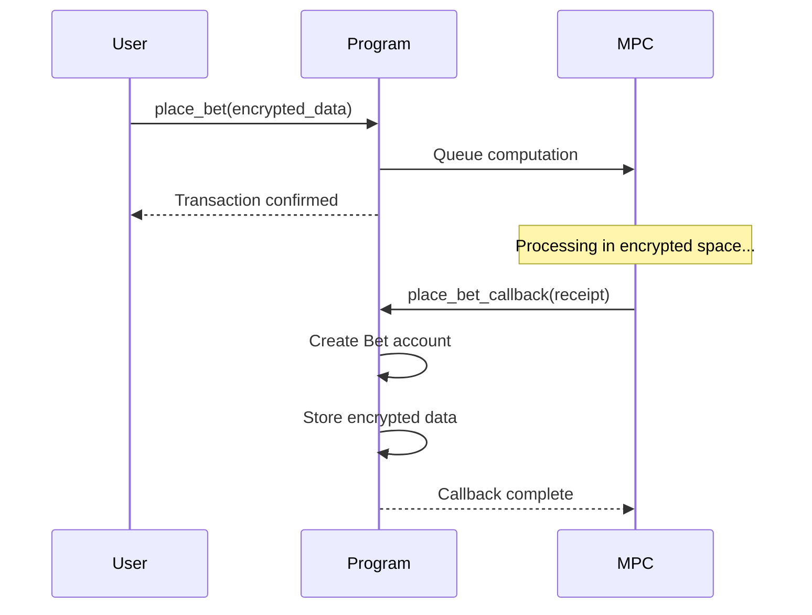

# Code Guide

A comprehensive walkthrough of the Dark Prediction Market codebase, explaining how each component works and how they integrate with Arcium's encrypted compute.

---

## Table of Contents

1. [Project Overview](#project-overview)
2. [Solana Program Structure](#solana-program-structure)
3. [State Structures](#state-structures)
4. [Instruction Handlers](#instruction-handlers)
5. [Encrypted Instructions](#encrypted-instructions)
6. [Client Integration](#client-integration)
7. [Testing](#testing)
8. [Key Patterns](#key-patterns)

---

## Project Overview

The codebase is organized into three main sections:

```
arcium-dark-prediction-market/
├── programs/dark-prediction-market/   # Solana on-chain program
├── encrypted-ixs/                     # Arcium MPC instructions
└── app/                               # Client application & demo
```

Each section has a specific role in enabling private prediction markets.

---

## Solana Program Structure

**Location**: `programs/dark-prediction-market/src/`

### Program Entry Point (`lib.rs`)

This is where we define the program's public interface - the instructions that can be called from clients.

```rust
use anchor_lang::prelude::*;

mod state;
mod instructions;
mod errors;

use state::*;
use instructions::*;
use errors::*;

declare_id!("5ReKPSDBcvh8M5nyhVBJsNxdAzC6LfJ5R6wjuApjgLhQ");

#[program]
pub mod dark_prediction_market {
    use super::*;

    /// Initialize a new prediction market
    pub fn initialize_market(
        ctx: Context<InitializeMarket>,
        market_id: u64,
        question: String,
        end_time: i64,
    ) -> Result<()> {
        instructions::initialize_market(ctx, market_id, question, end_time)
    }

    /// Queue encrypted bet placement computation
    pub fn place_bet(
        ctx: Context<PlaceBet>,
        computation_offset: u64,
        ciphertext_bet_amount: [u8; 32],
        ciphertext_prediction: [u8; 32],
        pub_key: [u8; 32],
        nonce: u128,
    ) -> Result<()> {
        instructions::place_bet(
            ctx,
            computation_offset,
            ciphertext_bet_amount,
            ciphertext_prediction,
            pub_key,
            nonce,
        )
    }

    /// Callback for bet placement - invoked by Arcium after MPC
    pub fn place_bet_callback(
        ctx: Context<PlaceBetCallback>,
        encrypted_receipt: Vec<u8>,
    ) -> Result<()> {
        instructions::place_bet_callback(ctx, encrypted_receipt)
    }

    /// Queue market resolution computation
    pub fn resolve_market(
        ctx: Context<ResolveMarket>,
        computation_offset: u64,
        actual_outcome: u8,
    ) -> Result<()> {
        instructions::resolve_market(ctx, computation_offset, actual_outcome)
    }

    /// Callback for market resolution
    pub fn resolve_market_callback(
        ctx: Context<ResolveMarketCallback>,
        resolution_data: Vec<u8>,
    ) -> Result<()> {
        instructions::resolve_market_callback(ctx, resolution_data)
    }

    /// Claim winnings after market resolution
    pub fn claim_winnings(
        ctx: Context<ClaimWinnings>,
        bet_id: u64,
    ) -> Result<()> {
        instructions::claim_winnings(ctx, bet_id)
    }
}
```

**Key Points**:
- `declare_id!()` sets the program's on-chain address
- The `#[program]` macro exposes functions as RPC endpoints
- Notice the **callback pattern**: `place_bet` → `place_bet_callback`
- Encrypted data is passed as byte arrays (`[u8; 32]`)

---

## State Structures

**Location**: `programs/dark-prediction-market/src/state.rs`

### Market Account

Stores public information about a prediction market.

```rust
use anchor_lang::prelude::*;

#[account]
#[derive(InitSpace)]
pub struct Market {
    pub market_id: u64,          // Unique identifier
    #[max_len(200)]
    pub question: String,        // Market question
    pub creator: Pubkey,         // Who created this market
    pub end_time: i64,           // Unix timestamp when betting closes
    pub total_bets: u64,         // Count of bets placed
    pub resolved: bool,          // Has outcome been determined?
    pub winning_side: Option<u8>, // 0=NO, 1=YES (None until resolved)
    pub bump: u8,                // PDA bump seed
}

impl Market {
    pub const SEED_PREFIX: &'static [u8] = b"market";
}
```

**Design Decisions**:

1. **`#[derive(InitSpace)]`**: Auto-calculates space needed for this account
2. **`#[max_len(200)]`**: Limits question length to control account size
3. **`Option<u8>` for winning_side**: Distinguishes between unresolved and resolved states
4. **PDA (Program Derived Address)**: Uses `market_id` as seed for deterministic address

**PDA Derivation**:
```rust
// How to find this account's address
let (market_pda, bump) = Pubkey::find_program_address(
    &[b"market", &market_id.to_le_bytes()],
    &program_id
);
```

---

### Bet Account

Stores encrypted bet data. This is where privacy happens!

```rust
#[account]
#[derive(InitSpace)]
pub struct Bet {
    pub bet_id: u64,              // Unique bet identifier
    pub market_id: u64,           // Which market
    pub bettor: Pubkey,           // Who placed this bet (public)
    
    // Encrypted fields - program cannot read these!
    pub encrypted_amount: [u8; 32],     // Ciphertext of bet amount
    pub encrypted_prediction: [u8; 32],  // Ciphertext of YES/NO
    pub nonce: [u8; 16],                // Encryption nonce
    pub pub_key: [u8; 32],              // Encryption public key
    
    pub timestamp: i64,           // When bet was placed
    pub claimed: bool,            // Has payout been claimed?
    pub bump: u8,                 // PDA bump seed
}

impl Bet {
    pub const SEED_PREFIX: &'static [u8] = b"bet";
}
```

**Privacy Properties**:

- `encrypted_amount`: A 32-byte ciphertext containing the actual bet amount
- `encrypted_prediction`: A 32-byte ciphertext containing 0 (NO) or 1 (YES)
- These can ONLY be processed by Arcium's MPC network
- The Solana program stores them but cannot read them

**Why These Fields Are Public**:
- `bettor`: Needed for wallet authentication
- `timestamp`: Used for ordering (doesn't reveal bet content)
- `bet_id` and `market_id`: Needed for account lookups
- `claimed`: Prevents double-claiming

**PDA Derivation**:
```rust
let (bet_pda, bump) = Pubkey::find_program_address(
    &[
        b"bet",
        &market_id.to_le_bytes(),
        &bet_id.to_le_bytes()
    ],
    &program_id
);
```

---

### Resolution Account

Stores market outcome and payout information after resolution.

```rust
#[account]
#[derive(InitSpace)]
pub struct Resolution {
    pub market_id: u64,        // Which market was resolved
    pub winning_side: u8,      // 0=NO won, 1=YES won
    pub total_pool: u64,       // Total of all bets (lamports)
    pub winning_pool: u64,     // Total of winning bets (lamports)
    pub payout_ratio: u64,     // Multiplier scaled by 1e6
    pub resolved_at: i64,      // Unix timestamp of resolution
    pub bump: u8,
}

impl Resolution {
    pub const SEED_PREFIX: &'static [u8] = b"resolution";
}
```

**How Payout Works**:

The `payout_ratio` is scaled by 1,000,000 for precision:

```rust
// Example calculation
let total_pool = 100_000_000_000;      // 100 SOL
let winning_pool = 60_000_000_000;     // 60 SOL
let payout_ratio = (total_pool * 1_000_000) / winning_pool;
// payout_ratio = 1,666,666 (represents 1.666666x multiplier)

// Individual payout
let bet_amount = 10_000_000_000;       // 10 SOL
let payout = (bet_amount * payout_ratio) / 1_000_000;
// payout = 16,666,666,666 lamports ≈ 16.67 SOL
```

**Why Scaling?**: Solana programs work with integers. Scaling by 1e6 gives us 6 decimal places of precision.

---

### Error Types (`errors.rs`)

Custom error messages for better debugging.

```rust
use anchor_lang::prelude::*;

#[error_code]
pub enum MarketError {
    #[msg("Market has already ended")]
    MarketEnded,
    
    #[msg("Market has not ended yet")]
    MarketNotEnded,
    
    #[msg("Market is not resolved")]
    MarketNotResolved,
    
    #[msg("Market is already resolved")]
    MarketAlreadyResolved,
    
    #[msg("Bet has already been claimed")]
    BetAlreadyClaimed,
    
    #[msg("Invalid bet amount")]
    InvalidBetAmount,
    
    #[msg("Invalid prediction value")]
    InvalidPrediction,
    
    #[msg("Computation aborted")]
    AbortedComputation,
    
    #[msg("Invalid encrypted data")]
    InvalidEncryptedData,
    
    #[msg("Unauthorized")]
    Unauthorized,
}
```

**Usage**:
```rust
require!(market.resolved, MarketError::MarketNotResolved);
```

This is clearer than generic errors and helps with debugging.

---

## Instruction Handlers

**Location**: `programs/dark-prediction-market/src/instructions/`

### 1. Initialize Market (`initialize_market.rs`)

Creates a new prediction market. This is straightforward - no encryption needed.

```rust
use anchor_lang::prelude::*;
use crate::state::*;
use crate::errors::*;

pub fn initialize_market(
    ctx: Context<InitializeMarket>,
    market_id: u64,
    question: String,
    end_time: i64,
) -> Result<()> {
    let market = &mut ctx.accounts.market;
    let clock = Clock::get()?;
    
    // Validation
    require!(end_time > clock.unix_timestamp, MarketError::MarketEnded);
    require!(question.len() <= 200, MarketError::InvalidEncryptedData);
    
    // Initialize market state
    market.market_id = market_id;
    market.question = question;
    market.creator = ctx.accounts.creator.key();
    market.end_time = end_time;
    market.total_bets = 0;
    market.resolved = false;
    market.winning_side = None;
    market.bump = ctx.bumps.market;
    
    msg!("Market {} initialized: ending at {}", market_id, end_time);
    
    Ok(())
}
```

**Account Validation**:

```rust
#[derive(Accounts)]
#[instruction(market_id: u64)]
pub struct InitializeMarket<'info> {
    #[account(
        init,                    // Create new account
        payer = creator,         // Creator pays rent
        space = 8 + Market::INIT_SPACE,  // Account size
        seeds = [Market::SEED_PREFIX, &market_id.to_le_bytes()],
        bump                     // PDA bump
    )]
    pub market: Account<'info, Market>,
    
    #[account(mut)]
    pub creator: Signer<'info>,
    
    pub system_program: Program<'info, System>,
}
```

**Key Points**:
- `#[instruction(market_id: u64)]`: Makes `market_id` available for PDA derivation
- `init`: Tells Anchor to create this account
- `payer = creator`: The creator pays for account creation
- `space = 8 + Market::INIT_SPACE`: 8 bytes discriminator + struct size

---

### 2. Place Bet (`place_bet.rs`)

This is where it gets interesting! Two instructions work together:

#### Part 1: Queue MPC Computation

```rust
pub fn place_bet(
    ctx: Context<PlaceBet>,
    computation_offset: u64,
    ciphertext_bet_amount: [u8; 32],
    ciphertext_prediction: [u8; 32],
    pub_key: [u8; 32],
    nonce: u128,
) -> Result<()> {
    let market = &ctx.accounts.market;
    let clock = Clock::get()?;
    
    // Verify market is still open
    require!(clock.unix_timestamp < market.end_time, MarketError::MarketEnded);
    require!(!market.resolved, MarketError::MarketAlreadyResolved);
    
    // In a real Arcium integration, here we would:
    // 1. Build arguments for the encrypted instruction
    // 2. Queue the computation via CPI to Arcium program
    // 3. Specify the callback instruction
    
    msg!("Bet queued for encrypted computation");
    msg!("Market: {}, Offset: {}", market.market_id, computation_offset);
    
    Ok(())
}
```

**What's Happening**:
1. Validate market is open and unresolved
2. Receive encrypted data as byte arrays (program can't read values)
3. Queue computation with Arcium network (via CPI in production)
4. Arcium will call back when computation is done

**In Production**: This would use Arcium's SDK to:
```rust
// Pseudo-code for real integration
let args = vec![
    Argument::ArcisPubkey(pub_key),
    Argument::PlaintextU128(nonce),
    Argument::EncryptedU64(ciphertext_bet_amount),
    Argument::EncryptedU8(ciphertext_prediction),
];

queue_computation(
    ctx.accounts,
    computation_offset,
    args,
    None,
    vec![PlaceBetCallback::callback_ix(&[])],
)?;
```

#### Part 2: Receive MPC Result

```rust
pub fn place_bet_callback(
    ctx: Context<PlaceBetCallback>,
    encrypted_receipt: Vec<u8>,
) -> Result<()> {
    let bet = &mut ctx.accounts.bet;
    let market = &mut ctx.accounts.market;
    let clock = Clock::get()?;
    
    // Parse encrypted receipt from MPC computation
    require!(encrypted_receipt.len() >= 96, MarketError::InvalidEncryptedData);
    
    // Store encrypted bet data
    bet.bet_id = market.total_bets;
    bet.market_id = market.market_id;
    bet.bettor = ctx.accounts.bettor.key();
    
    // Copy encrypted fields (still encrypted!)
    bet.encrypted_amount.copy_from_slice(&encrypted_receipt[0..32]);
    bet.encrypted_prediction.copy_from_slice(&encrypted_receipt[32..64]);
    bet.nonce.copy_from_slice(&encrypted_receipt[64..80]);
    bet.pub_key.copy_from_slice(&encrypted_receipt[80..112]);
    
    bet.timestamp = clock.unix_timestamp;
    bet.claimed = false;
    bet.bump = ctx.bumps.bet;
    
    // Increment bet counter
    market.total_bets = market.total_bets.checked_add(1).unwrap();
    
    msg!("Bet {} placed successfully (encrypted)", bet.bet_id);
    
    Ok(())
}
```

**Callback Flow**:



**Key Points**:
- Callback is invoked BY Arcium, not by user
- Bet account is created in the callback (when we have the receipt)
- Data remains encrypted even after callback
- Total bets counter increments (public information)

---

### 3. Resolve Market (`resolve_market.rs`)

Similar two-part pattern: queue computation, receive result.

#### Part 1: Queue Resolution

```rust
pub fn resolve_market(
    ctx: Context<ResolveMarket>,
    computation_offset: u64,
    actual_outcome: u8,
) -> Result<()> {
    let market = &ctx.accounts.market;
    let clock = Clock::get()?;
    
    // Verify market can be resolved
    require!(clock.unix_timestamp >= market.end_time, MarketError::MarketNotEnded);
    require!(!market.resolved, MarketError::MarketAlreadyResolved);
    require!(actual_outcome <= 1, MarketError::InvalidPrediction);
    
    // Only creator can resolve
    require!(
        ctx.accounts.resolver.key() == market.creator,
        MarketError::Unauthorized
    );
    
    msg!("Market {} resolution queued", market.market_id);
    msg!("Actual outcome: {}", actual_outcome);
    
    Ok(())
}
```

**In Production**: The MPC computation would:
1. Load all encrypted bets for this market
2. Aggregate YES bets (without revealing individuals)
3. Aggregate NO bets (without revealing individuals)
4. Calculate payout ratio
5. Return resolution data

#### Part 2: Store Resolution

```rust
pub fn resolve_market_callback(
    ctx: Context<ResolveMarketCallback>,
    resolution_data: Vec<u8>,
) -> Result<()> {
    let market = &mut ctx.accounts.market;
    let resolution = &mut ctx.accounts.resolution;
    let clock = Clock::get()?;
    
    // Parse resolution data from MPC
    require!(resolution_data.len() >= 40, MarketError::InvalidEncryptedData);
    
    // Extract values (revealed by MPC)
    let winning_side = resolution_data[0];
    let total_pool = u64::from_le_bytes(resolution_data[1..9].try_into().unwrap());
    let winning_pool = u64::from_le_bytes(resolution_data[9..17].try_into().unwrap());
    let payout_ratio = u64::from_le_bytes(resolution_data[17..25].try_into().unwrap());
    
    // Update market state
    market.resolved = true;
    market.winning_side = Some(winning_side);
    
    // Store resolution details
    resolution.market_id = market.market_id;
    resolution.winning_side = winning_side;
    resolution.total_pool = total_pool;
    resolution.winning_pool = winning_pool;
    resolution.payout_ratio = payout_ratio;
    resolution.resolved_at = clock.unix_timestamp;
    resolution.bump = ctx.bumps.resolution;
    
    msg!("Market {} resolved!", market.market_id);
    msg!("Winning side: {}", winning_side);
    msg!("Payout ratio: {}x (scaled)", payout_ratio);
    
    Ok(())
}
```

**What Gets Revealed**:
- Total pool (aggregate of all bets)
- Winning pool (aggregate of winning bets)
- Payout ratio (computed from aggregates)
- Winning side (YES or NO)

**What Stays Private**:
- Individual bet amounts
- Individual predictions
- Who bet on which side

---

### 4. Claim Winnings (`claim_winnings.rs`)

Winners claim their proportional share of the pool.

```rust
pub fn claim_winnings(
    ctx: Context<ClaimWinnings>,
    bet_id: u64,
) -> Result<()> {
    let market = &ctx.accounts.market;
    let bet = &mut ctx.accounts.bet;
    let resolution = &ctx.accounts.resolution;
    
    // Verify market is resolved
    require!(market.resolved, MarketError::MarketNotResolved);
    require!(!bet.claimed, MarketError::BetAlreadyClaimed);
    require!(bet.bettor == ctx.accounts.bettor.key(), MarketError::Unauthorized);
    
    // Mark as claimed
    bet.claimed = true;
    
    // In production with Arcium:
    // 1. Queue payout calculation in MPC
    // 2. MPC computes: (encrypted_bet_amount * payout_ratio) / 1e6
    // 3. Reveal only the payout amount (not original bet)
    // 4. Transfer that amount to bettor
    
    msg!("Winnings claimed for bet {}", bet_id);
    msg!("Payout ratio: {}", resolution.payout_ratio);
    
    Ok(())
}
```

**Account Validation**:

```rust
#[derive(Accounts)]
#[instruction(bet_id: u64)]
pub struct ClaimWinnings<'info> {
    #[account(mut)]
    pub market: Account<'info, Market>,
    
    #[account(
        mut,
        seeds = [
            Bet::SEED_PREFIX,
            &market.market_id.to_le_bytes(),
            &bet_id.to_le_bytes()
        ],
        bump = bet.bump
    )]
    pub bet: Account<'info, Bet>,
    
    #[account(
        seeds = [Resolution::SEED_PREFIX, &market.market_id.to_le_bytes()],
        bump = resolution.bump
    )]
    pub resolution: Account<'info, Resolution>,
    
    #[account(mut)]
    pub bettor: Signer<'info>,
}
```

**Security Checks**:
- `seeds` and `bump`: Verify account PDAs are correct
- `bettor: Signer`: Only the bettor can claim their winnings
- `require!(!bet.claimed, ...)`: Prevents double-claiming

---

## Encrypted Instructions

**Location**: `encrypted-ixs/`

These are written in Rust but compile to run on Arcium's MPC network, NOT on Solana validators.

### 1. Place Bet (`place_bet.rs`)

```rust
use arcis_imports::*;

#[encrypted]
mod circuits {
    use arcis_imports::*;

    /// Input values for placing a bet
    pub struct BetInput {
        pub market_id: u64,
        pub bet_amount: u64,   // Encrypted!
        pub prediction: u8,    // Encrypted!
        pub user_nonce: u64,
    }

    /// Output structure for bet placement
    pub struct BetReceipt {
        pub bet_id: u64,
        pub encrypted_amount: u64,
        pub encrypted_prediction: u8,
        pub timestamp: u64,
    }

    /// Main encrypted instruction
    #[instruction]
    pub fn place_encrypted_bet(
        input_ctxt: Enc<Shared, BetInput>
    ) -> Enc<Shared, BetReceipt> {
        // Convert to Arcis encrypted type
        let input = input_ctxt.to_arcis();
        
        // ALL OPERATIONS ON ENCRYPTED DATA
        // No node can see the actual values!
        
        // Generate unique bet ID
        let bet_id = input.market_id * 1000000u64 + input.user_nonce;
        
        // Create encrypted receipt
        let receipt = BetReceipt {
            bet_id,
            encrypted_amount: input.bet_amount,      // Still encrypted
            encrypted_prediction: input.prediction,   // Still encrypted
            timestamp: 0u64,
        };
        
        // Return encrypted receipt
        input_ctxt.owner.from_arcis(receipt)
    }
}
```

**Understanding the Types**:

- `Enc<Shared, T>`: An encrypted value of type `T` shared across MPC nodes
- `.to_arcis()`: Converts to Arcis-specific encrypted type for computation
- `.from_arcis()`: Converts back from Arcis type
- `input_ctxt.owner`: Reference to the encryption context

**The Magic**: All arithmetic (`*`, `+`, etc.) happens on encrypted values. Each node computes on its share, and the results are combined.

---

### 2. Resolve Market (`resolve_market.rs`)

This performs aggregation in encrypted space.

```rust
#[encrypted]
mod circuits {
    use arcis_imports::*;

    pub struct MarketState {
        pub market_id: u64,
        pub total_yes_bets: u64,    // Encrypted aggregate
        pub total_no_bets: u64,     // Encrypted aggregate
        pub bet_count: u32,
        pub actual_outcome: u8,
    }

    pub struct ResolutionResult {
        pub market_id: u64,
        pub winning_side: u8,
        pub total_pool: u64,
        pub winning_pool: u64,
        pub payout_ratio: u64,
    }

    #[instruction]
    pub fn resolve_encrypted_market(
        state_ctxt: Enc<Shared, MarketState>
    ) -> Enc<Shared, ResolutionResult> {
        let state = state_ctxt.to_arcis();
        
        // Calculate total pool (encrypted addition)
        let total_pool = state.total_yes_bets + state.total_no_bets;
        
        // Conditional on encrypted outcome
        let winning_pool = if state.actual_outcome == 1u8 {
            state.total_yes_bets
        } else {
            state.total_no_bets
        };
        
        // Calculate payout ratio (encrypted division)
        let payout_ratio = if winning_pool > 0u64 {
            (total_pool * 1000000u64) / winning_pool
        } else {
            1000000u64
        };
        
        let result = ResolutionResult {
            market_id: state.market_id,
            winning_side: state.actual_outcome,
            total_pool,
            winning_pool,
            payout_ratio,
        };
        
        // Result is revealed, but individual bets stay encrypted
        state_ctxt.owner.from_arcis(result)
    }
}
```

**Key Operations**:

1. **Encrypted Addition**: `total_yes_bets + total_no_bets`
2. **Encrypted Conditional**: `if actual_outcome == 1u8 { ... }`
3. **Encrypted Division**: `(total_pool * 1000000) / winning_pool`

All of these happen without any node seeing the actual values!

---

### 3. Generate Randomness (`generate_randomness.rs`)

MPC-based fair random number generation.

```rust
#[encrypted]
mod circuits {
    use arcis_imports::*;

    pub struct RandomInput {
        pub seed1: u64,    // From different sources
        pub seed2: u64,
        pub seed3: u64,
        pub modulus: u64,
    }

    #[instruction]
    pub fn generate_random(
        input_ctxt: Enc<Shared, RandomInput>
    ) -> u64 {
        let input = input_ctxt.to_arcis();
        
        // Combine seeds in MPC
        let combined = (input.seed1 ^ input.seed2) + input.seed3;
        
        // Apply modulus
        let random_value = if input.modulus > 0u64 {
            combined % input.modulus
        } else {
            combined
        };
        
        // Reveal the result
        random_value.reveal()
    }
}
```

**Why This Is Fair**:
- Seeds come from different sources (user, oracle, blockchain)
- Combination happens in MPC (no single party knows all seeds)
- Result is unpredictable and unmanipulable
- `.reveal()` makes the result public after computation

---

## Client Integration

**Location**: `app/arcium-client.ts`

### Arcium Client

Handles encryption and MPC interaction from the client side.

```typescript
import { ArciumClient as ArciumSDK } from '@arcium-hq/client';
import { PublicKey } from '@solana/web3.js';

export class ArciumClient {
    private sdk: ArciumSDK;
    
    constructor(mxePublicKey: Buffer) {
        this.sdk = new ArciumSDK(mxePublicKey);
    }
    
    /**
     * Encrypt bet data before submission
     */
    async encryptBet(betData: {
        marketId: bigint,
        betAmount: bigint,
        prediction: number,
        userNonce: bigint
    }) {
        // Generate encryption keypair
        const keypair = this.sdk.generateKeypair();
        const nonce = this.sdk.generateNonce();
        
        // Encrypt amount
        const ciphertext_bet_amount = await this.sdk.encrypt(
            betData.betAmount,
            keypair.publicKey,
            nonce
        );
        
        // Encrypt prediction
        const ciphertext_prediction = await this.sdk.encrypt(
            betData.prediction,
            keypair.publicKey,
            nonce
        );
        
        return {
            ciphertext_bet_amount,
            ciphertext_prediction,
            pub_key: keypair.publicKey,
            nonce: nonce
        };
    }
}
```

**Encryption Flow**:

1. Generate ephemeral keypair for this bet
2. Create unique nonce
3. Encrypt each sensitive value
4. Return ciphertext bundle

**Usage in Client**:

```typescript
// In app/index.ts
const client = new DarkPredictionMarketClient(connection, wallet);
await client.initialize(mxePublicKey);

// Place encrypted bet
await client.placeBet(
    marketId,
    5.0,    // 5 SOL (will be encrypted)
    'YES'   // Prediction (will be encrypted)
);
```

---

### Demo Application (`app/index.ts`)

Shows complete flow from market creation to claiming winnings.

```typescript
async function runDemo() {
    console.log('🚀 Dark Prediction Market Demo\n');
    
    // Setup
    const connection = new Connection(RPC_ENDPOINT);
    const wallet = new anchor.Wallet(Keypair.generate());
    const client = new DarkPredictionMarketClient(connection, wallet);
    
    // Initialize Arcium client
    const mxePublicKey = await getMXEPublicKey(PROGRAM_ID);
    await client.initialize(mxePublicKey);
    
    // 1. Create market
    const marketId = BigInt(1);
    await client.createMarket(
        marketId,
        'Will Bitcoin reach $100k by end of October 2025?',
        7 * 24 * 60 * 60  // 7 days
    );
    
    // 2. Place encrypted bets
    await client.placeBet(marketId, 5.0, 'YES');
    await client.placeBet(marketId, 3.5, 'NO');
    await client.placeBet(marketId, 7.2, 'YES');
    
    // 3. Resolve market
    await client.resolveMarket(marketId, 'YES');
    
    // 4. Claim winnings
    await client.claimWinnings(marketId, BigInt(0));
    
    console.log('✅ Demo Complete!');
}
```

**Key Methods**:

```typescript
class DarkPredictionMarketClient {
    // Encrypt and place bet
    async placeBet(marketId: bigint, betAmount: number, prediction: 'YES' | 'NO') {
        const betAmountLamports = BigInt(betAmount * LAMPORTS_PER_SOL);
        const predictionValue = prediction === 'YES' ? 1 : 0;
        
        // Encrypt
        const encrypted = await this.arciumClient.encryptBet({
            marketId,
            betAmount: betAmountLamports,
            prediction: predictionValue,
            userNonce: BigInt(Date.now())
        });
        
        // Submit transaction
        await this.program.methods
            .placeBet(
                computationOffset,
                Array.from(encrypted.ciphertext_bet_amount),
                Array.from(encrypted.ciphertext_prediction),
                Array.from(encrypted.pub_key),
                encrypted.nonce
            )
            .accounts({ /* ... */ })
            .rpc();
    }
}
```

---

## Testing

**Location**: `tests/dark-prediction-market.test.ts`

### Test Structure

```typescript
describe('dark-prediction-market', () => {
    let provider: anchor.AnchorProvider;
    let program: Program<DarkPredictionMarket>;
    let marketId: bigint;
    
    before(async () => {
        provider = anchor.AnchorProvider.env();
        anchor.setProvider(provider);
        program = anchor.workspace.DarkPredictionMarket;
    });
    
    it('Creates a prediction market', async () => {
        marketId = BigInt(Date.now());
        
        const [marketPda] = PublicKey.findProgramAddressSync(
            [Buffer.from('market'), Buffer.from(marketId.toString())],
            program.programId
        );
        
        await program.methods
            .initializeMarket(
                marketId,
                'Will it rain tomorrow?',
                Math.floor(Date.now() / 1000) + 86400
            )
            .accounts({
                market: marketPda,
                creator: provider.wallet.publicKey,
                systemProgram: SystemProgram.programId,
            })
            .rpc();
        
        const market = await program.account.market.fetch(marketPda);
        assert.equal(market.question, 'Will it rain tomorrow?');
        assert.equal(market.totalBets, 0);
        assert.equal(market.resolved, false);
    });
    
    it('Places encrypted bets', async () => {
        // Test implementation
    });
    
    it('Resolves market', async () => {
        // Test implementation
    });
    
    it('Claims winnings', async () => {
        // Test implementation
    });
});
```

**Run Tests**:
```bash
anchor test
```

---

## Key Patterns

### 1. The Callback Pattern

Many Arcium operations use a two-phase pattern:

```rust
// Phase 1: Queue computation
pub fn some_operation(ctx: Context<Op>, encrypted_data: [u8; 32]) {
    // Queue MPC computation
    // Returns immediately
}

// Phase 2: Receive result
pub fn some_operation_callback(ctx: Context<OpCallback>, result: Vec<u8>) {
    // Process MPC result
    // Update state
}
```

**Why**: MPC computations are asynchronous. The initial instruction queues work, and Arcium calls back when done.

---

### 2. PDA (Program Derived Addresses)

All accounts use PDAs for deterministic addresses:

```rust
// Market PDA
seeds = [b"market", market_id.to_le_bytes()]

// Bet PDA
seeds = [b"bet", market_id.to_le_bytes(), bet_id.to_le_bytes()]

// Resolution PDA
seeds = [b"resolution", market_id.to_le_bytes()]
```

**Benefits**:
- No need to store addresses
- Deterministic (same inputs = same address)
- Controlled by program (no private key)

---

### 3. Encrypted vs Public Data

Clear separation in account structure:

```rust
pub struct Bet {
    // Public fields
    pub bet_id: u64,
    pub bettor: Pubkey,
    pub timestamp: i64,
    
    // Encrypted fields (arrays of bytes)
    pub encrypted_amount: [u8; 32],
    pub encrypted_prediction: [u8; 32],
    pub nonce: [u8; 16],
    pub pub_key: [u8; 32],
}
```

**Rule**: If it needs to be private, it must be encrypted BEFORE reaching the blockchain.

---

### 4. Error Handling

Always use custom errors for clarity:

```rust
// Bad
require!(market.resolved, ProgramError::InvalidAccountData);

// Good
require!(market.resolved, MarketError::MarketNotResolved);
```

Custom errors make debugging much easier.

---

### 5. Account Space Calculation

Anchor auto-calculates with `InitSpace`:

```rust
#[account]
#[derive(InitSpace)]
pub struct Market {
    pub market_id: u64,           // 8 bytes
    #[max_len(200)]
    pub question: String,         // 4 + 200 bytes
    pub creator: Pubkey,          // 32 bytes
    // ...
}

// Usage
space = 8 + Market::INIT_SPACE
// 8 bytes for discriminator + struct size
```

---

## Summary

The Dark Prediction Market combines three layers:

1. **Solana Program**: Manages on-chain state and coordinates operations
2. **Arcium MPC Network**: Performs encrypted computation
3. **Client Applications**: Encrypts data and provides user interface

**Key Innovation**: Sensitive data (bet amounts and predictions) are encrypted client-side and never visible to the Solana program. They're processed by Arcium's MPC network, where computation happens without decryption.

**Result**: A prediction market that's as transparent and fair as public blockchain, but with the privacy of traditional finance.

---

## Further Reading

- [ARCHITECTURE.md](./ARCHITECTURE.md) - System architecture and data flows
- [ARCIUM_INTEGRATION.md](./ARCIUM_INTEGRATION.md) - Deep dive into encrypted compute
- [README.md](./README.md) - Project overview and quick start
- [Arcium Documentation](https://docs.arcium.com)
- [Anchor Book](https://www.anchor-lang.com/)

---

*Code written with privacy in mind, powered by Arcium's encrypted compute on Solana.*

